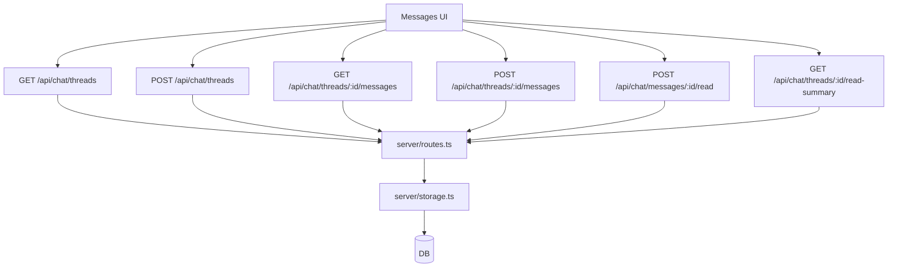
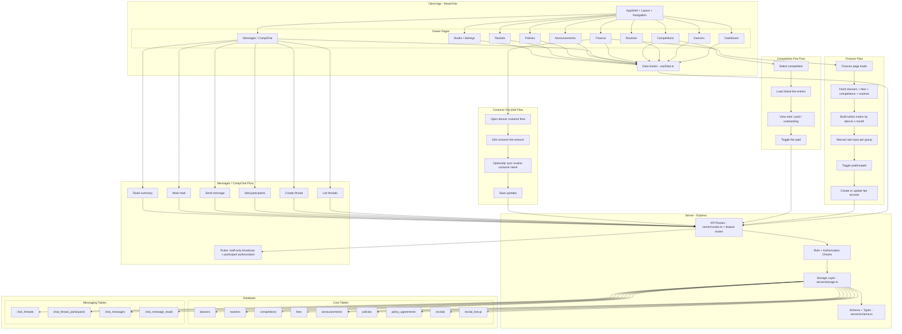

# Studio Maestro OwnerView — Master Map

This file saves the complete architecture + flow mapping content for planning your flow diagram work.

## 1) System Map (Big Picture)

```text
[Mobile Owner UI (React/Vite)]
  ├─ Pages (Dashboard, Dancers, Routines, Competitions, Finance, Messages, etc.)
  ├─ Data Hooks (client/src/hooks/useData.ts)
  └─ Calls REST API (/api/...)

[Express Server]
  ├─ Routing layer (server/routes.ts + feature route files)
  ├─ Storage layer (server/storage.ts)
  ├─ Schema/Types (server/schema.ts)
  └─ DB access (server/db.ts via Drizzle)

[Database]
  ├─ Core studio entities (dancers, routines, competitions, fees, etc.)
  └─ Messaging entities (chat_threads, participants, messages, reads)
```

---

## 2) Frontend Page Map (Owner View)

Main owner mobile pages:
- Dashboard
- Dancers
- Routines
- Competitions
- Finance
- Messages / CompChat
- Announcements
- Policies
- Recitals
- Studio / Studio Settings

Supporting parent pages also exist (ParentBilling, ParentClasses, ParentContacts, ParentPolicies).

---

## 3) Domain/Data Map

### Core Domains
- **Dancers**
- **Routines**
- **Competitions**
- **Fees** (Tuition / Competition / Costume)
- **Announcements**
- **Policies + Policy Agreements**
- **Recitals + Recital Lineup**

### Messaging/CompChat Domain
- `chat_threads`
  - type: `direct_parent_staff | compchat | group_broadcast`
  - flags: `staffOnlyBroadcast`, `isTimeSensitive`, `expiresAt`
- `chat_thread_participants`
  - `participantId`, `participantRole`, `authorized`
- `chat_messages`
  - sender + body + `isStaffBroadcast`
- `chat_message_reads`
  - read receipts by reader

---

## 4) API Flow Map (Messaging)



Rules enforced in routes:
- Only `owner/staff` can create staff-only broadcasts and send staff broadcast messages.
- Participants must be authorized (or be studio staff).
- Read receipts are recorded per message and summarized per thread.

---

## 5) API Flow Map (Finance)

```mermaid
flowchart TD
  A[Finance Page] --> B[useFees/useDancers/useCompetitions/useRoutines]
  B --> C[/api/fees, /api/dancers, /api/competitions, /api/routines]
  A --> D[useUpdateFee/useCreateFee/useUpdateRoutine]
  D --> E[PATCH/POST endpoints]
  E --> F[storage.ts]
  F --> G[(DB)]
```

Finance behavior:
- Tuition rates are manual numeric inputs by group.
- Tuition matrix is built by dancer x month.
- Paid/unpaid toggles update existing fees or create virtual→real fee entries.

---

## 6) Recommended Diagram Pack

Suggested diagram set for full product mapping:
1. **System Context** (Client ↔ API ↔ DB)
2. **Navigation Flow** (Owner page-to-page)
3. **Finance Flow** (rates → matrix → fee updates)
4. **CompChat Flow** (thread create → message send → read receipts)
5. **Competition Fee Flow** (competition select → fee entries → paid tracking)
6. **Costume Fee Edit Flow** (fee edit + routine costume name sync)

---

## 7) Master Flow Diagram (Combined)



---

## 8) Optional Simplified Diagram Prompt

If you want a non-technical stakeholder version, use this prompt as a starter:

> “Create a simple user journey diagram showing Owner navigation across Finance, Competitions, and Messages/CompChat, including key actions (view totals, mark paid, send broadcast, mark read) and outcomes.”
